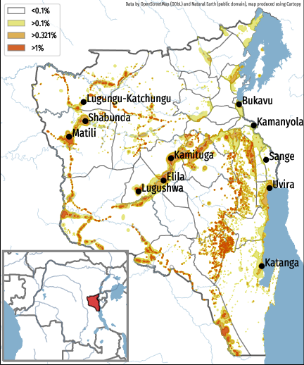

# MAP TB Incidence in South Kivu

This repository contains the script and datasets used to produce the Tuberculosis Incidence map of South Kivu found in:

> **Data-driven identification of previously unrecognized communities with alarming levels of tuberculosis infection in the Democratic Republic of Congo.**
> *Faccin, Rusumba, Ushindi, Riziki, Boutachkourt, André*
> [medRxiv, (2021)](https://www.medrxiv.org/content/10.1101/2021.12.09.21267511)

## Instructions

To run the script you need the following requirements:

- `cartopy`
- `matplotlib`
- `shapely`

To run the script just:

```
$ python3 map_plot.py
```

The script has been tested with `python 3.10`.

## Output

The output should be as follows:



## Data

The data used to construct the map have been gathered from:

- [OpenStreetMap](https://OpenStreetMap.org) (data under [ODbL](https://wiki.osmfoundation.org/wiki/Licence))
- [Natural Earth](https://www.naturalearthdata.com) (data under [public domain](https://www.naturalearthdata.com/about/))

(Data are included into this repository and may result outdated).

